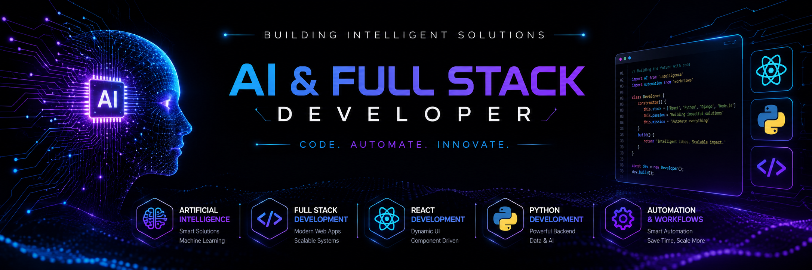

  

# Hi 👋 I'm Usman

### AI & Full Stack Developer

I'm passionate about building AI-powered applications, automation workflows, and scalable full-stack solutions.

🚀 Currently working on:
- AI Agents
- Enterprise Software
- n8n Automations

🌱 Currently learning:
- Multi-Agent Systems
- LLM Applications
- Cloud Deployment

